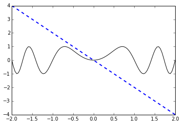
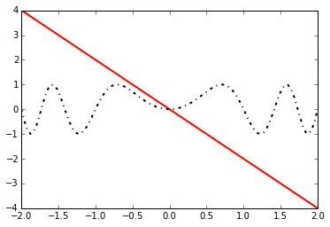
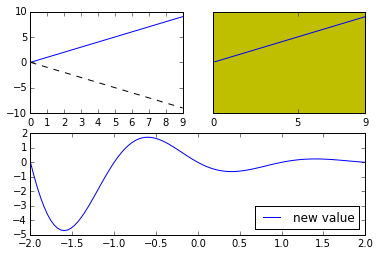
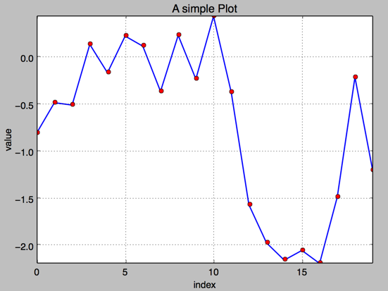
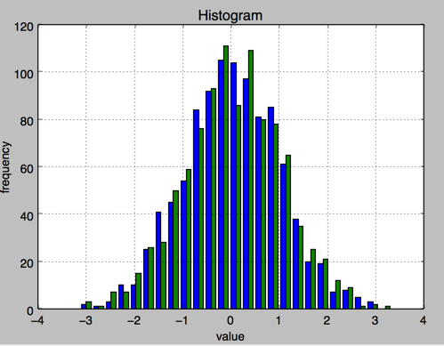
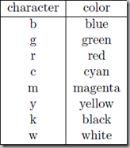
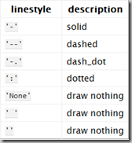
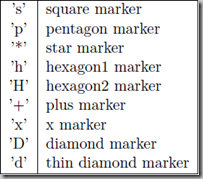
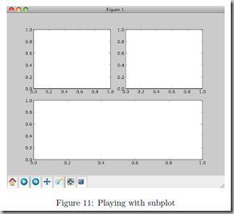

# python入门05数据可视化
百度搜索：

python特征工程，绘图

python特征工程 数据可视化

## 简介
特征工程之前用excel做的，简单的还行，稍稍复杂就非常慢了。考虑换用python，相关资料整理了下，备查

## 01，pycharm绘图不显示问题
pandas中Series、DataFrame的plot()方法不显示图片

```
Series([4,5,7]).plot() 
plt.show()  #需要加这个
```
标题：Python可视化学习（2）：Matplotlib快速绘图基础
地址：[http://www.cnblogs.com/zhanghaohong/p/6674474.html](http://www.cnblogs.com/zhanghaohong/p/6674474.html)

## 02，基本曲线图
```
#通过Line2D的Setter方法（set_*）进行设置；
#主要是通过返回的Line2D对象进行设置，这里的设置非常多，可以参考手册内容
line1,line2=plt.plot(x,-x\*2,x,np.sin(x\*\*2*np.pi))
#设置line1的属性
line1.set_linewidth(2)
line1.set_color('b')
line1.set_linestyle("--")
#设置line2的属性
line2.set_color('k')
line2.set_linestyle('-')
```



```
#通过pyplot.setp（）进行批量设置；
line1,line2=plt.plot(x,-x\*2,x,np.sin(x\*\*2*np.pi))
plt.setp(line1,color='r',linewidth=2)#采用关键字参数
plt.setp(line2,"color",'k','linewidth',2,'linestyle','-.')#采用变量形式，这时候属性必须用字符串形式成对表示（数值除外）
```



## 03，子图
创建子图：plt.subplot(nrows,ncols,char_num)

当选定了子图后，那么这个子图就是当前选定子图，后续所有操作都是在这个子图上，可以通过gca()获取当前的axe。

```
ax=plt.subplot(221)#创建2*2个子图，并选定第一个（一般选定的顺序是从左到右，从上到下）
#print type(ax),打印显示器为AxesSubplot对象
#<class 'matplotlib.axes._subplots.AxesSubplot'>
ax.plot(np.arange(0,10),np.arange(0,10))
plt.plot(np.arange(0,10),-np.arange(0,10),'k--')#两种操作等价
#------------------------------------------------
ax2=plt.subplot(222,axisbg='y')#选取第一行，第二个axe,并设置背景颜色为黄色
ax2.plot(np.arange(0,10),np.arange(0,10))
plt.plot(np.arange(0,10),-np.arange(0,10),'y-')
#设置其y轴的值不显示,x轴只显示\[0,5,9\]
plt.yticks(\[\])
plt.xticks(\[0,5,9\])
#------------------------------------------------
ax3=plt.subplot(212)#重新建立分区，并选定第二个，这时初始的分区方法被覆盖。
ax3.plot(x,func(x),label="new value")
ax3.legend(loc='best')
```




标题：Python绘图

地址：[http://www.cnblogs.com/chaoren399/p/5792168.html](http://www.cnblogs.com/chaoren399/p/5792168.html)

## 04，添加标题和标签 plt.title, plt.xlabe, plt.ylabel 离散点, 线
```
#!/etc/bin/python
#coding=utf-8
import numpy as np
import matplotlib as mpl
import matplotlib.pyplot as plt
np.random.seed(1000)
y = np.random.standard_normal(20)
plt.figure(figsize=(7,4)) #画布大小
plt.plot(y.cumsum(),'b',lw = 1.5) # 蓝色的线
plt.plot(y.cumsum(),'ro') #离散的点
plt.grid(True)
plt.axis('tight')
plt.xlabel('index')
plt.ylabel('value')
plt.title('A simple Plot')
plt.show()
```



## 05，直方图
```
#!/etc/bin/python
#coding=utf-8
import numpy as np
import matplotlib as mpl
import matplotlib.pyplot as plt
np.random.seed(2000)
y = np.random.standard_normal((1000, 2))
plt.figure(figsize=(7,5))
plt.hist(y,label=\['1st','2nd'\],bins=25)#stacked=True,同图堆叠
plt.grid(True)
plt.xlabel('value')
plt.ylabel('frequency')
plt.title('Histogram')
plt.show()
```




## 06，其他
```
plt.figure(1) # 创建图表1  
散点图 Scatter plots：pl.plot(x, y)改成pl.plot(x, y, 'o')
线条红色：把pl.plot(x, y, 'o')改成pl.plot(x, y, ’or’)
线条样式 Changing the line style虚线:plot(x,y, '--')
蓝色星型markers：plot(x,y, ’b*’)  
```



子图控制
```
f1 = pl.figure(1)  
pl.subplot(221)  
pl.subplot(222)  
pl.subplot(212)  
```



## 友情链接
Python--matplotlib绘图可视化知识点整理：[http://blog.csdn.net/panda1234lee/article/details/52311593](http://blog.csdn.net/panda1234lee/article/details/52311593)

python画图：[http://www.cnblogs.com/similarface/p/6252496.html](http://www.cnblogs.com/similarface/p/6252496.html)

基于 Python 的数据可视化：[http://mt.sohu.com/20170102/n477572079.shtml](http://mt.sohu.com/20170102/n477572079.shtml)  