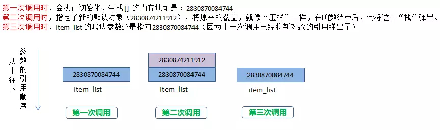
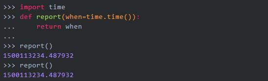

# python实战04常见坑
何谓坑：凡是和**大多数人的直观理解不一致**的，都可称之为“坑”


一部分在其他博文中提到过，不再重复

比如：

```
默认参数最好不为可变对象
时有时无的切片异常
不执行的del
return不一定都是函数的终点
```
博文:python进阶17炫技巧,中提过，所以不再重复


博文：python阅读wtfbook疑问和验证，也记录了一些坑，也不再重复


本文作为对以上的补充


## 括号和元组()
单个元素要被识别为元组，必须在括号后面加个逗号 , 详见如下代码：

```
In [65]: a = (10)

In [66]: type(a)
Out[66]: int

In [67]: b = (10,)

In [68]: type(b)
Out[68]: tuple
```
## 空集合空字典{} 
创建集合与字典，它们都用一对 {}，但是默认返回字典，而不是集合。要想创建空集合，可使用内置函数 set()

```
In [69]: d = {}

In [70]: type(d)
Out[70]: dict

In [71]: s = set()

In [72]: type(s)
Out[72]: set
```

## 默认参数最好不为可变对象
函数的参数分三种 - 可变参数 - 默认参数 - 关键字参数

当你在传递默认参数时，有新手很容易踩雷的一个坑。

先来看一个示例

```
def func(item, item_list=[]):
    item_list.append(item)
    print(item_list)

func('iphone')
func('xiaomi', item_list=['oppo','vivo'])
func('huawei')
```
在这里，你可以暂停一下，思考一下会输出什么？

思考过后，你的答案是否和下面的一致呢

```
['iphone']
['oppo', 'vivo', 'xiaomi']
['iphone', 'huawei']
```
如果是，那你可以跳过这部分内容，如果不是，请接着往下看，这里来分析一下。

Python 中的 def 语句在每次执行的时候都初始化一个函数对象，这个函数对象就是我们要调用的函数，可以把它当成一个一般的对象，只不过这个对象拥有一个可执行的方法和部分属性。

对于参数中提供了初始值的参数，由于 Python 中的函数参数传递的是对象，也可以认为是传地址，在第一次初始化 def 的时候，会先生成这个可变对象的内存地址，然后将这个默认参数 item_list 会与这个内存地址绑定。在后面的函数调用中，如果调用方指定了新的默认值，就会将原来的默认值覆盖。如果调用方没有指定新的默认值，那就会使用原来的默认值。




stackoverflow上有一个更适当的例子来说明默认参数是在定义的时候求值，而不是调用的时候。



## 时有时无的切片异常
alist 只有5 个元素，当你取第 6 个元素时，会抛出索引异常。这与我们的认知一致。

```
>>> alist = [0, 1, 2, 3, 4]
>>> alist[5]
Traceback (most recent call last):
  File "<stdin>", line 1, in <module>
IndexError: list index out of range
```
但是当你使用 alist[5:] 取一个区间时，即使 alist 并没有 第 6个元素，也不抛出异常，而是会返回一个新的列表。

```
>>> alist = [0, 1, 2, 3, 4]
>>> alist[5:]
[]
>>> alist[100:]
[]
```

##  return不一定都是函数的终点
那结论就出来了，如果 finally 里有显式的 return，那么这个 return 会直接覆盖 try 里的 return，而如果 finally 里没有 显式的 return，那么 try 里的 return 仍然有效。

## 用户无感知的小整数池
Python 定义了一个小整数池 [-5, 256] 这些整数对象是提前建立好的，不会被垃圾回收。


## 循环中的局部变量泄露

## python版本升级
python3.x并不向后兼容，所以如果从2.x升级到3.x的时候得小心了，下面列举两点：

在python2.7中，range的返回值是一个**列表**；而在python3.x中，返回的是一个r**ange对象**。

map()、filter()、 dict.items()在python2.7返回列表，而在3.x中返回迭代器。当然**迭代器大多数都是比较好的选择**，更加pythonic，但是也有缺点，就是**只能遍历一次**。在instagram的分享中，也提到因为这个导致的一个坑爹的bug。


## 参考
Python 黑魔法指南 50 例:python.iswbm.com/en/latest/c01/c01_10.html

Python有什么不为人知的坑？：https://www.zhihu.com/question/29823322?sort=created

这十多个Python中的坑，简直太恶心了，摔的我眼冒金星:https://www.pythonf.cn/read/42134

