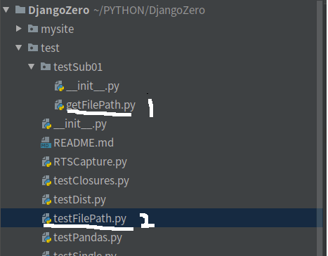

# python实战05文件路径(找不到文件)
开发时遇到问题，文件路径不正确，找不到文件等等，都是这一类问题.


## curdir,argv,file
举例:




文件1代码:

```
def get_cur_path1():
    import os
    print(os.path.abspath(os.curdir))


def get_cur_path2():
    import sys
    print(sys.argv[0])


def get_cur_path3():
    import os
    print(os.path.abspath(__file__))
```

文件2代码:

```
from test.testSub01.getFilePath import get_cur_path3, get_cur_path2, get_cur_path1

get_cur_path1()
get_cur_path2()
get_cur_path3()
```
文件2执行输出结果和解析:

```
/home/john/PYTHON/DjangoZero/test                    #01,项目work dir
/home/john/PYTHON/DjangoZero/test/testFilePath.py    #02,调用者的路径
/home/john/PYTHON/DjangoZero/test/testSub01/getFilePath.py    #03,当前文件真实路径
```

如果在代码01,里面写了open('../a/','r')类似的代码，那么其实是使用了**workdir为基准的路径**，

本例就是：/home/john/PYTHON/DjangoZero/test/../a=>/home/john/PYTHON/DjangoZero/a/

如果大家都是同一个项目，一般没问题，有偶尔会有别人开发的模块，自己去调用，发现别人可以正常跑的代码，自己确提示找不到文件

**大概率就是workdir配置的不一致导致**，(默认work direction,大部分是执行的py文件的父文件夹,比如aa/bb/c.py 就是aa/bb/)

如何解决此类问题呢？最好的做法是使用上面“03,当前文件真实路径为基准”的方法（以03返回的路径为基准，../到需访问文件相应的文件夹），这样的话，不论从哪里调用，只要**py和要访问的目标文件相对位置不变**就行了，而觉大多数情况下，二者是位于同一个文件夹中的。


举例:如果在getFilePath.py中访问,上层文件夹同级别的README.md,则使用

```
with open(os.path.join(os.path.dirname(__file__),'../README.md')) as f:
    print(f.read())
```
这样的话，不论从哪个路调用getFilePath.py里面的方法，都会找到文件的正确路径。


## normpath
另外在做路径连接时，优先使用os.path.normpath,而非os.path.join，虽然join比较常见，但是坑比较多

```
print('normpath')
print(os.path.normpath("%s/%s" % ("dirName1", "dirName2")))
print(os.path.normpath("%s/%s" % ("/dirName1", "dirName2")))
print(os.path.normpath("%s/%s" % ("/dirName1/", "dirName2")))
print(os.path.normpath("%s/%s" % ("/dirName1/", "/dirName2")))
print(os.path.normpath("%s/%s" % ("/dirName1/", "/dirName2/")))
print(os.path.normpath("%s/%s" % ("/dirName1/", "/dirName2/1.txt")))
print('join')
print(os.path.join("dirName1", "dirName2"))
print(os.path.join("/dirName1/", "/dirName2"))
print(os.path.join("/dirName1/", "/dirName2/"))
print(os.path.join("dirName1", "dirName2/1.txt"))
```

运行结果:

```
normpath# 结果均符合直观理解
dirName1/dirName2
/dirName1/dirName2
/dirName1/dirName2
/dirName1/dirName2
/dirName1/dirName2
/dirName1/dirName2/1.txt
join# 个别结果不符合直观理解
dirName1/dirName2#符合直观
/dirName2#不符合直观
/dirName2/#不符合直观
dirName1/dirName2/1.txt#符合直观

```

## 更多功能测试
```
(base) john@john-P95-HP:~/PYTHON/DjangoZero$ python test/testFilePath.py 
argv:test/testFilePath.py
file:test/testFilePath.py
abs file:/home/john/PYTHON/DjangoZero/test/testFilePath.py
dir file:test
dir abs file :/home/john/PYTHON/DjangoZero/test
curdir:.
abs file:/home/john/PYTHON/DjangoZero
dir file:
dir abs file :/home/john/PYTHON
getpwd:/home/john/PYTHON/DjangoZero
abs file:/home/john/PYTHON/DjangoZero
dir file:
dir abs file :/home/john/PYTHON


cur:.
abs cur:/home/john/PYTHON/DjangoZero
argv:['test/testFilePath.py']
file:/home/john/PYTHON/DjangoZero/test/testSub01/getFilePath.py
abs file:/home/john/PYTHON/DjangoZero/test/testSub01/getFilePath.py

```
```
(base) john@john-P95-HP:~/PYTHON/DjangoZero$ cd test/
(base) john@john-P95-HP:~/PYTHON/DjangoZero/test$ python testFilePath.py 
argv:testFilePath.py
file:testFilePath.py
abs file:/home/john/PYTHON/DjangoZero/test/testFilePath.py
dir file:
dir abs file :/home/john/PYTHON/DjangoZero/test
curdir:.
abs file:/home/john/PYTHON/DjangoZero/test
dir file:
dir abs file :/home/john/PYTHON/DjangoZero
getpwd:/home/john/PYTHON/DjangoZero/test
abs file:/home/john/PYTHON/DjangoZero/test
dir file:
dir abs file :/home/john/PYTHON/DjangoZero


cur:.
abs cur:/home/john/PYTHON/DjangoZero/test
argv:['testFilePath.py']
file:/home/john/PYTHON/DjangoZero/test/testSub01/getFilePath.py
abs file:/home/john/PYTHON/DjangoZero/test/testSub01/getFilePath.py
```
```
(base) john@john-P95-HP:~/PYTHON/DjangoZero/test$  /home/john/anaconda3/envs/django_zero/bin/python testFilePath.py
argv:testFilePath.py
file:testFilePath.py
abs file:/home/john/PYTHON/DjangoZero/test/testFilePath.py
dir file:
dir abs file :/home/john/PYTHON/DjangoZero/test
curdir:.
abs file:/home/john/PYTHON/DjangoZero/test
dir file:
dir abs file :/home/john/PYTHON/DjangoZero
getpwd:/home/john/PYTHON/DjangoZero/test
abs file:/home/john/PYTHON/DjangoZero/test
dir file:
dir abs file :/home/john/PYTHON/DjangoZero


cur:.
abs cur:/home/john/PYTHON/DjangoZero/test
argv:['testFilePath.py']
file:/home/john/PYTHON/DjangoZero/test/testSub01/getFilePath.py
abs file:/home/john/PYTHON/DjangoZero/test/testSub01/getFilePath.py

```

父文件路径

argv=__FILE__

abs(),dir()函数,

cur()简写.

getpwd(),cur（）表现一致


子文件路径

argv!=__file__

**agrv:启动脚本的argv(父程序)**

**__File__：子程序完整路径**

**abs(cur):父程序启动位置路径**

getcwd和abs(cur)依然一致


使用 __file__ 获取当前路径:__file__ 表示显示文件当前的位置：

如果当前文件包含在 sys.path 里面，那么 __file__ 返回一个相对路径

如果当前文件不包含在 sys.path 里面，那么 __file__ 返回一个绝对路径


os.getcwd()与os.curdir的使用
os.getcwd()与os.curdir都是用于获取当前执行python文件的文件夹，不过当直接使用os.curdir时会返回‘.’(这个表示当前路径），记住返回的是当前执行python文件的文件夹，而不是python文件所在的文件夹。
PS：**os.getcwd()与os.path.abspath(os.curdir)返回的结果是一样的**.

## 附录

Python - 编写模块时 获取当前路径 __file__ 与 getcwd():https://blog.csdn.net/sigmarising/article/details/83444463

python函数深入浅出 12.os.getcwd()函数详解:https://www.jianshu.com/p/77bf050ba274

