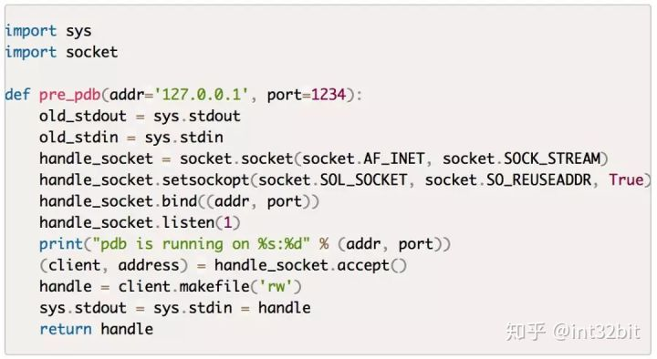
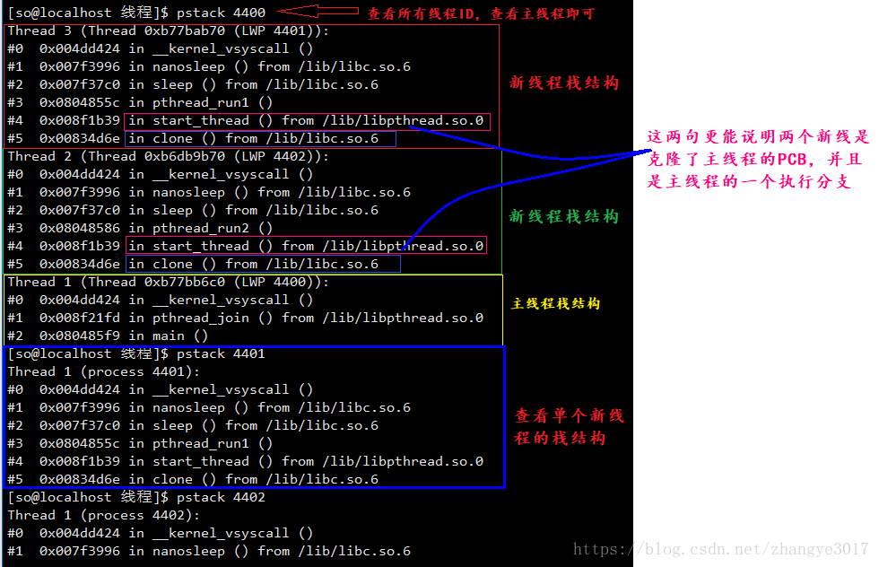
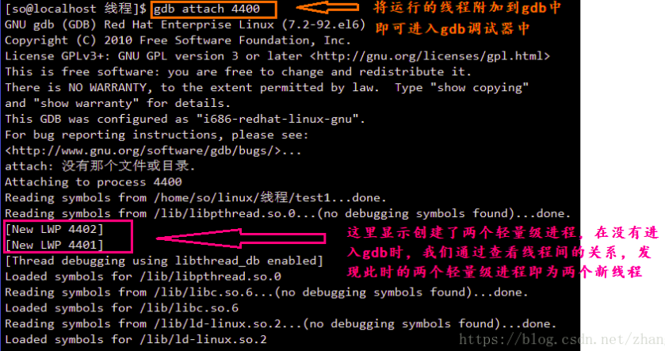
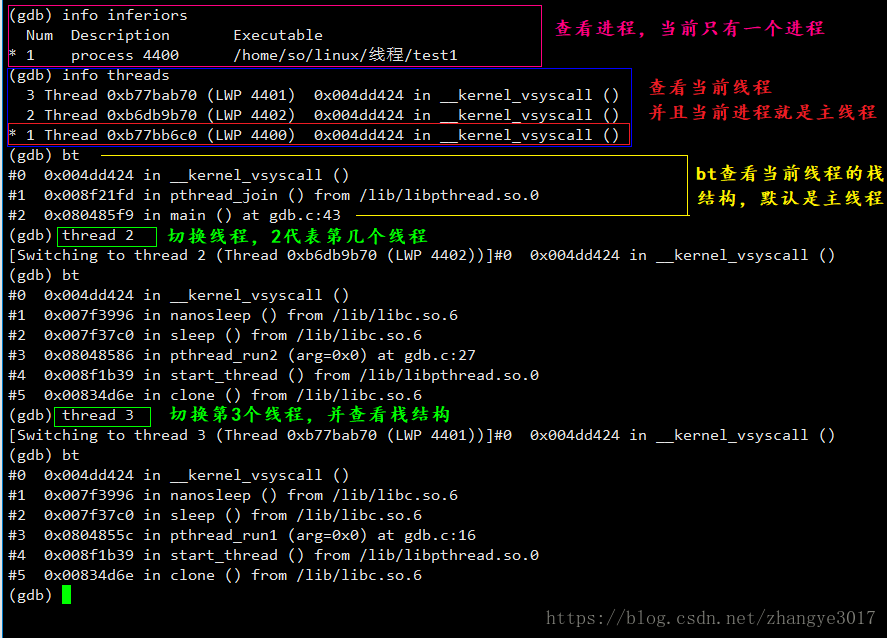
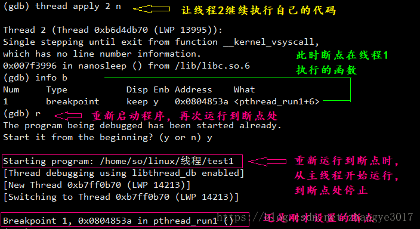
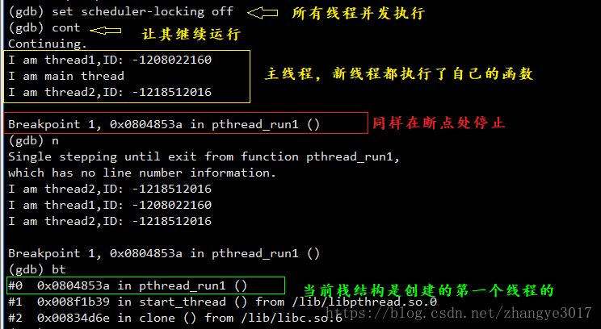

# python实战07调试pdb

## Python多线程的时候调试的简单方法(thread.run)
https://blog.csdn.net/york1996/article/details/89305847

```
for thread in threads:
     thread.run()#原本是thread.start（）
```
## OpenStack断点调试方法总结(重定向stdin,stdout实现远程调试)
https://zhuanlan.zhihu.com/p/63898351




通过这种方式可以实现远程调试，不过我们不用每次都写那么长一段代码，社区已经有实现了，只需要使用rpdb替换pdb即可进行远程调试，原理与之类似，

## python 多线程断点调试(管道方法)
https://blog.csdn.net/DeathlessDogface/article/details/84074461

插入断点

```
import pdb
pdb.Pdb(stdin=open('/root/p_in','r+'),stdout=open('/root/p_out','w+')).set_trace()
```
创建管道

```
mkfifo /root/p_in /root/p_out
```

## gdb调试多进程和多线程命令(设置follow-fork-mode)
https://blog.csdn.net/pbymw8iwm/article/details/7876797

设置follow-fork-mode(默认值：parent)和detach-on-fork（默认值：on）即可。

follow-fork-mode  detach-on-fork   说明

```
parent                   on               只调试主进程（GDB默认）
child                     on               只调试子进程
parent                   off              同时调试两个进程，gdb跟主进程，子进程block在fork位置
child                     off              同时调试两个进程，gdb跟子进程，主进程block在fork位置
```
设置方法：set follow-fork-mode [parent|child]   set detach-on-fork [on|off]


查询正在调试的进程：info inferiors

切换调试的进程： inferior <infer number>

查询线程：info threads

切换调试线程：thread <thread number>


## Linux多进程和多线程的一次gdb调试实例(参考上面的)
https://typecodes.com/cseries/multilprocessthreadgdb.html


follow-fork-mode  detach-on-fork    说明

```
parent              on          GDB默认的调试模式：只调试主进程
child               on          只调试子进程
parent              off         同时调试两个进程，gdb跟主进程，子进程block在fork位置
child               off         同时调试两个进程，gdb跟子进程，主进程block在fork位置
```
查看gdb默认的参数设置：

```
(gdb) show follow-fork-mode
Debugger response to a program call of fork or vfork is "parent".
(gdb) show detach-on-fork
Whether gdb will detach the child of a fork is on.

catch fork 
info b
bt
```

## 线程的查看以及利用gdb调试多线程(详细，截图中标示含义)
https://blog.csdn.net/zhangye3017/article/details/80382496


pstree -p xx


pstack xx




gdb attach 主线程ID




常用命令

```
1.查看进程：info inferiors
2.查看线程：info threads
3.查看线程栈结构：bt
4.切换线程：thread n（n代表第几个线程）
```



执行线程2的函数，指行完毕继续运行到断点处

```
1. 继续使某一线程运行：thread apply 1-n（第几个线程） n
2. 重新启动程序运行到断点处：r
```



只运行当前线程

```
1. 设置：set scheduler-locking on
2. 运行：n
```


所有线程并发执行

```
1. 设置：set scheduler-locking off
2. 运行：n
```



## GDB多线程多进程调试(操作和命令对应)
https://cloud.tencent.com/developer/article/1142947


thread thread-id实现不同线程之间的切换

info threads查询存在的线程

thread apply [thread-id-list] [all] args在一系列线程上执行命令

线程中设置指定的断点

set print thread-events控制打印线程启动或结束是的信息


set scheduler-locking off|on|step在使用step或是continue进行调试的时候，其他可能也会并行的执行，如何才能够只让被调试的线程执行呢？该命令工具可以达到这个效果。

off：不锁定任何线程，也就是所有的线程都执行，这是默认值。

on：只有当前被调试的线程能够执行。

step：阻止其他线程在当前线程单步调试时，抢占当前线程。只有当next、continue、util以及finish的时候，其他线程才会获得重新运行的机会。


使用thread apply来让一个或是多个线程执行指定的命令。例如让所有的线程打印调用栈信息。

```
(gdb) thread apply all bt

Thread 3 (Thread 0x7ffff688a700 (LWP 20568)):
#0  0x00007ffff7138a3d in nanosleep () from /lib64/libc.so.6
#1  0x00007ffff71388b0 in sleep () from /lib64/libc.so.6
#2  0x000000000040091e in threadPrintWorld (arg=0x0) at multithreads.cpp:18
#3  0x00007ffff74279d1 in start_thread () from /lib64/libpthread.so.0
#4  0x00007ffff71748fd in clone () from /lib64/libc.so.6

Thread 2 (Thread 0x7ffff708b700 (LWP 20567)):
#0  threadPrintHello (arg=0x0) at multithreads.cpp:10
#1  0x00007ffff74279d1 in start_thread () from /lib64/libpthread.so.0
#2  0x00007ffff71748fd in clone () from /lib64/libc.so.6

Thread 1 (Thread 0x7ffff7fe5720 (LWP 20564)):
#0  0x00007ffff7138a3d in nanosleep () from /lib64/libc.so.6
#1  0x00007ffff71388b0 in sleep () from /lib64/libc.so.6
#2  0x00000000004009ea in main (argc=1, argv=0x7fffffffe628) at multithreads.cpp:47
```


## 参考
pyrasite(4年前的老项目，久不更新）

线程的查看以及利用gdb调试多线程（同上，但多了“安装的pstack有问题，自实现”，但pstack依然乱码）：https://www.cnblogs.com/fengtai/p/12181907.html


