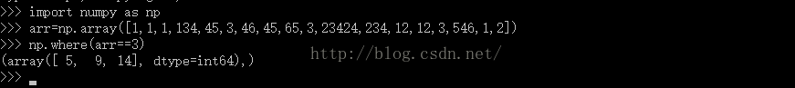

# python小白04map,numpy,pandas速查
## Map操作  

```
dict["w"] = "watermelon"  
dict.get("c", "apple")    
print dict.pop("b")  
dict.update(dict2)  
dict.items()  
dict.keys()  
dict.values()  
dict.clear()  
print d.popitem()   
#按照key排序print sorted(dict.items(), key=lambda d: d[0])  
#按照value排序print sorted(dict.items(), key=lambda d: d[1])  
#字典的浅拷贝dict2 = dict.copy()  
#深拷贝import copy，dict3 = copy.copy(dict)  
```
Python两列表同位置同元素个数  
a:[0, 0, 1, 0, 0, 0, 0, 0, 0, 1]  
b:[1, 0, 1, 1, 0, 0, 0, 0, 0, 0]  
map(cmp,a,b).count(0)  
若是只判断“1” 的个数呢  
map(lambda x,y:x+y, a, b).count(2)  
或者sum(map(lambda x, y: 1 if x==y==1 else 0, a, b))  
  
参考：https://uqer.io/community/share/54ca15f9f9f06c276f651a56

## numpy
```
import numpy as np  
a = np.arange(20)，np.random.rand(5)，np.linspace(0, 2, 9)  
a = a.reshape(4, 5)  
type(a)  
a.ndim，a.shape，a.size，a.dtype  
d = (4, 5)，np.zeros(d)，np.ones(d, dtype=int)  
  
raw = [[0,1,2,3,4], [5,6,7,8,9]]  
b = np.array(raw)  
  
a = np.asmatrix(a),b = np.mat(b)  
b = np.matrix('1.0 2.0; 3.0 4.0')  
  
全部的'+'，'-'，'*'，'/'运算都是基于全部的数组元素的  
'+='、'-='、'*='、'/='操作符在NumPy中同样支持：  
print np.exp(a)  
print np.sqrt(a)  
print np.square(a)  
print np.power(a, 3)  
a = np.arange(20).reshape(4,5)  
print "a:"  
print a  
print "sum of all elements in a: " + str(a.sum())  
print "maximum element in a: " + str(a.max())  
print "minimum element in a: " + str(a.min())  
print "maximum element in each row of a: " + str(a.max(axis=1))  
print "minimum element in each column of a: " + str(a.min(axis=0))  
stock_prices['kdj_j_yest']=np.insert(np.array(stock_prices['kdj_j'][:-1]),0,None)  
```
**布尔操作**
由于Python中的布尔运算使用and、or和not等关键字，它们无法被重载，因此数组的布尔运算只能通过相应的ufunc函数进行。这些函数名都以“logical_”开头，np.logical_and np.logical_not np.logical_or  np.logical_xor  
```
>>> a == b  
array([False, False,  True, False, False], dtype=bool)  
>>> a > b  
array([False, False, False,  True,  True], dtype=bool)  
>>> np.logical_or(a==b, a>b) # 和 a>=b 相同  
  
print a[0][1]  
print a[0, 1]  
b = a.copy()  
a[:,[1,3]]  
a[:, 2][a[:, 0] > 5]  
  
np.nan_to_num(a)  
c = np.hstack([a,b])  
d = np.vstack([a,b])  
```  
**条件查找过滤**  
where  
  

```
a = np.array([[1,2,3,4,5],[6,7,8,9,10]]) #原始数据
e = (a > 6) |  (a <2)    #构造对原始数据进行筛选的条件
a4 = np.where(e,a,0) #把满足条件的选择出来,原封不动的保存,不满足条件的元素置零
                                   #本质上,就是把矩阵元素,按照条件分类.
a5 = a[e]                     #把满足条件的元素选择出来,构成新的元素子集合
```

argwhere  
argwhere: arg(argument的缩写)，where(表示索引在哪里)，用这种方法记忆就不会混淆了  
```
>>> x = np.arange(6).reshape(2,3)
>>> x
array([[0, 1, 2],
       [3, 4, 5]])
>>> np.argwhere(x>1)
array([[0, 2],
       [1, 0],
       [1, 1],
       [1, 2]])
```

## serices的创建  
```
s = Series(np.random.randn(5), index=['a', 'b', 'c', 'd', 'e'], name='my_series')  
d = {'a': 0., 'b': 1, 'c': 2}，s = Series(d)  
Series(d, index=['b', 'c', 'd', 'a'])，Series(4., index=['a', 'b', 'c', 'd', 'e'])  
serices 的选择和boolean过滤：  
s[:2]，s[[2,0,4]]，s[['e', 'i']]  
s[s > 0.5]  
'e' in s  
```
## DataFrame的创建

```
df = DataFrame(columns=('lib', 'qty1', 'qty2'))或df = DataFrame(d, index=['r', 'd', 'a'], columns=['two', 'three'])  
d = {'one': Series([1., 2., 3.], index=['a', 'b', 'c']), 'two': Series([1., 2., 3., 4.], index=['a', 'b', 'c', 'd'])}，df = DataFrame(d)  
d = {'one': [1., 2., 3., 4.], 'two': [4., 3., 2., 1.]}，df = DataFrame(d, index=['a', 'b', 'c', 'd'])  
d= [{'a': 1.6, 'b': 2}, {'a': 3, 'b': 6, 'c': 9}]，df = DataFrame(d)  
```
**行拼接**：for i in range(5):a = DataFrame([np.linspace(i, 5*i, 5)], index=[index[i]])，df = pd.concat([df, a], axis=0)  
**列拼接**：a = Series(range(5))，b = Series(np.linspace(4, 20, 5))，df = pd.concat([a, b], axis=1)  
(或pd.merge(df1,df2,left_index=True,right_index=True,how='outer'))  
**列扩展**：val = Series([-1.2, -1.5, -1.7], index=['two', 'four', 'five'])，frame2['debt'] = val  
**行扩展**：  df.loc[len(df)] = row或者res=res.append(a new pd.Series),  
**删除行、列**：del DF['column-name']或者df.drop([Column Name or list],inplace=True,axis=1)（凡是会对原数组作出修改并返回一个新数组的，往往都有一个 inplace可选参数。如果手动设定为True（默认为False），那么原数组直接就被替换。也就是说，采用inplace=True之后，原数组名（如2和3情况所示）对应的内存值直接改变；而采用inplace=False之后，原数组名对应的内存值并不改变，需要将新的结果赋给一个新的数组或者覆盖原数组的内存位置）  
**DataFrame属性**  
```
print df.index  
print df.values  
```
**DataFrame选择和切片**：  
目前初步确立用法：[][]时列行，[,]时行列，iloc，loc指定的是行  
```
print df['b'][2]  
print df['b']['gamma']  
print df.iloc[1]  
print df.loc['beta']  
print df[1:3]  
bool_vec = [True, False, True, True, False]  
print "Selecting by boolean vector:"  
print df[bool_vec]  
print df[['b', 'd']].iloc[[1, 3]]  
print df.iloc[[1, 3]][['b', 'd']]  
print df[['b', 'd']].loc[['beta', 'delta']]  
print df.loc[['beta', 'delta']][['b', 'd']]  
最快访问：at,iat  
print df.iat[2, 3]，print df.at['gamma', 'd']  
最快访问的智能化：ix  
print df.ix['gamma', 4]，print df.ix[['delta', 'gamma'], [1, 4]]，print df.ix[[1, 2], ['b', 'e']]  
```


**索引扩展**  

```
df = df.reindex(df.index|set(['e']))  
df = df.reindex(list(df.index).append( [ 'c', 'd', 'e' ]))  
  
pd.set_option('display.width', 200)  
dates = pd.date_range('20150101', periods=5)  
df = pd.DataFrame(np.random.randn(5, 4),index=dates,columns=list('ABCD'))  
df2 = pd.DataFrame({ 'A' : 1., 'B': pd.Timestamp('20150214'), 'C': pd.Series(1.6,index=list(range(4)),dtype='float64'), 'D' : np.array([4] * 4, dtype='int64'), 'E' : 'hello pandas!' })  
stock_list = ['000001.XSHE', '000002.XSHE', '000568.XSHE', '000625.XSHE', '000768.XSHE', '600028.XSHG', '600030.XSHG', '601111.XSHG', '601390.XSHG', '601998.XSHG']  
raw_data = DataAPI.MktEqudGet(secID=stock_list, beginDate='20150101', endDate='20150131', pandas='1')  
df = raw_data[['secID', 'tradeDate', 'secShortName', 'openPrice', 'highestPrice', 'lowestPrice', 'closePrice', 'turnoverVol']]  
print df.shape  
print df.head()  
print df.tail(3)  
print df.describe()  
print df.sort(columns='tradeDate').head()  
df = df.sort(columns=['tradeDate', 'secID'], ascending=[False, True])  
print df[df.closePrice > df.closePrice.mean()].head()  
print df[df['secID'].isin(['601628.XSHG', '000001.XSHE', '600030.XSHG'])].head()  
print df.dropna(subset=['closePrice']).shape  
print df.dropna(thresh=6).shape  
print df.dropna(how='all').shape  
print df.dropna().shape  
print df.fillna(value=20150101).head()  
print df['closePrice'].value_counts().head()  
print df[['closePrice']].apply(lambda x: (x - x.min()) / (x.max() - x.min())).head()  
dat1 = df[['secID', 'tradeDate', 'closePrice']].head()  
dat2 = df[['secID', 'tradeDate', 'closePrice']].iloc[2]  
dat = dat1.append(dat2, ignore_index=True)  
dat1 = df[['secID', 'tradeDate', 'closePrice']]  
dat2 = df[['secID', 'tradeDate', 'turnoverVol']]  
dat = dat1.merge(dat2, on=['secID', 'tradeDate'])  
df_grp = df.groupby('secID')  
grp_mean = df_grp.mean()  
df2 = df.sort(columns=['secID', 'tradeDate'], ascending=[True, False])  
print df2.drop_duplicates(subset='secID')  
print df2.drop_duplicates(subset='secID', take_last=True)  
dat = df[df['secID'] == '600028.XSHG'].set_index('tradeDate')['closePrice']  
dat.plot(title="Close Price of SINOPEC (600028) during Jan, 2015")  
obj.combine_first(other) 方法的作用是使用 other 中的数据去填补 obj 中的 NA 值，就像打补丁。而且可以自动对齐。  
 marketIndex[field]=(marketIndex[field]+stock_prices[field]).combine_first(marketIndex[field])  
```
**多重索引**  
增加(创建)  
```
df1=pd.DataFrame(np.arange(12).reshape(4,3),index=[list("AABB"),[1,2,1,2]],columns=[list("XXY"),[10,11,10]]) df1.index=pd.MultiIndex.from_arrays([list("AABB"),[3,4,3,4]],names=["AB","num"])
df = df.set_index(['class','id'])
```

修改  
```
df1.columns.names=['XY','sum'] 
df1.index.names=['AB','num']
df1.index=pd.MultiIndex.from_arrays([list("AABB"),[3,4,3,4]],names=["AB","num"])
df1.swaplevel('AB','num')
```
查询  
```
df.loc[('A',slice(None)),:]
df2.loc[('语文',slice(None)),:]
UnsortedIndexError: 'MultiIndex Slicing requires the index to be fully lexsorted tuple len (2), lexsort depth (0)' 

对index排序后切片选择index
df2 = df2.sort_index(level='课程')
df2.loc[('语文',slice(None)),:]

获取相应内容
.get_level_values()    Index    level    int/name: 获取对应级别的索引
```

参考:  
https://blog.csdn.net/weixin_38168620/article/details/80071141  
https://blog.csdn.net/PIPIXIU/article/details/80232805  
https://www.cnblogs.com/P--K/p/8672563.html  
